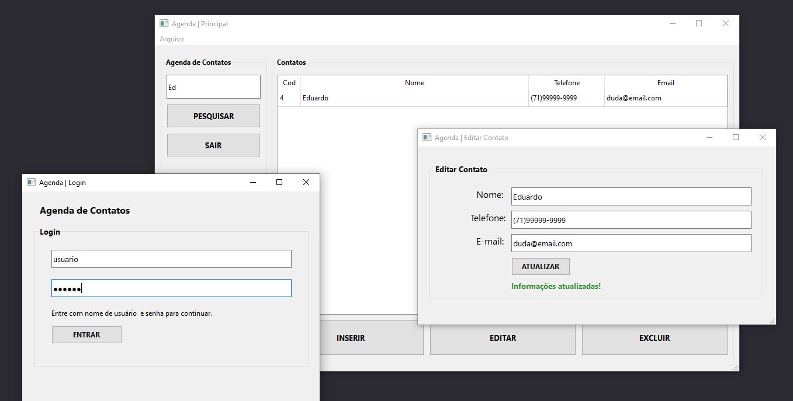

<h1 align="left">Agenda de Contatos</h1>

<h2>Tecnologias</h2>
Esse projeto foi desenvolvido com as seguintes tecnologias:  
<ul>
    <li>Python</li>
    <li>PyQt6</li>
</ul>
<h2>Projeto</h2>

Estudo Python (Interface Gráfica): Conceitos de Orientação a objetos, CRUD,  Criação de Pacotes e Interface Gráfica. Desenvolvimento de uma Aplicação de Agenda de Contatos utilizando PyQt6 e SQLite3. Projeto pessoal (estudo).

